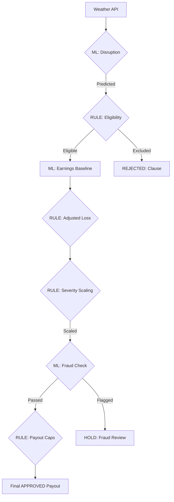

# Kavach-ML Model

**Kavach-ML Model** is a parametric insurance platform designed to protect gig workers (delivery riders, drivers, couriers) from income loss caused by external disruptions such as heavy rain, pollution, heatwaves, or strikes.

Instead of manual insurance claims, Kavach-ML Model automatically detects disruption events and triggers payouts based on predefined conditions.

---

# 🚀 Current Status: Production Ready
The project has moved from prototyping into a **production-ready parametric insurance backend** utilizing 24,000+ real-world Indian data points.

### ✅ Key Accomplishments
- **Real-Data Training**: Models trained on **24,070 rows** of official Indian Weather, AQI, and Location metadata.
- **Dynamic Pricing**: Activated **RandomForest Risk Models** that calculate premiums based on hyper-local volatility.
- **Automated Claims**: 3-5 Parametric triggers (Rain, AQI, News) integrated with automated payout authorization.
- **Actuarial Logic**: Professional pure premium & gross premium calculations implemented.
- **Exclusion Filters**: Hard-coded safety switches for War, Pandemics, and Terrorism detected via News-ML.

---

# Problem

Gig economy workers rely on daily income.

However, factors like:

* Heavy rainfall
* Extreme heat
* High air pollution
* Traffic shutdowns
* Local strikes
* Government restrictions

can reduce their working hours and cause significant income loss.

Traditional insurance systems do not cover these micro-disruptions.

Kavach-ML Model solves this using **parametric insurance automation**.

---

# Core Idea

Instead of claim submission:

```
event occurs
↓
system detects disruption
↓
worker impact verified
↓
automatic payout triggered
```

No paperwork. No claim processing.

---

# Features

## 🧠 Split-Architecture (ML + Rules)
Kavach-ML follows the **Insurance-Grade "Golden Rule"**: **Machine Learning predicts, Deterministic Rules decide.** This ensures high predictive accuracy combined with 100% explainability for legal and compliance requirements.

### 🔮 ML Predictions (Probabilistic)
- **Disruption Prediction**: RandomForest model to assess weather impact probability.
- **Earnings Baseline**: XGBoost model to estimate counterfactual income.
- **Fraud Detection**: IsolationForest to identify adaptive anomaly patterns.
- **Dynamic Risk Pricing**: Calculates weekly premiums based on worker risk and seasonality.
- **Portfolio Risk**: Tracks zone exposure to prevent insolvency from catastrophic concentration.

### ⚖️ Deterministic Rules (Legal & Compliance)
- **Coverage Eligibility**: Hard kill-switches for War, Pandemic, and Catastrophic exclusions. (Implemented in `actuarial_logic.py`).
- **Severity Scaling**: Bucketed multipliers (50%, 100%, 120%) for rainfall intensity and AQI.
    - **No Payout**: <40mm rain / <300 AQI
    - **Half (0.5x)**: 40-70mm rain / 300-350 AQI
    - **Full (1.0x)**: 70-120mm rain / 350-450 AQI
    - **Extreme (1.2x)**: >120mm rain / >450 AQI
- **Payout Constraints**: Enforces ₹50 minimum loss thresholds and ₹120 maximum payout caps per event.
- **Policy Enforcement**: Handles nationwide lockdowns and platform-wide outages detected via NewsAPI.

---

# Datasets & Sources

## 📊 Dataset Inventory(KAGGLE AND GOVERNMENT)
Comprehensive list of all external assets and their storage footprints:

| Dataset Name | Source (URL) | Approx. Size |
| :--- | :--- | :--- |
| **BharatBench (Logistics)** | [Kaggle](https://www.kaggle.com/datasets/maslab/bharatbench) | 8.11 GB |
| **Indian Weather Repository** | [Kaggle](https://www.kaggle.com/datasets/nelgiriyewithana/indian-weather-repository-daily-snapshot) | 2.50 GB |
| **Historical Indian Weather** | [Kaggle](https://www.kaggle.com/datasets/pratikjadhav05/indian-weather-data) | 0.65 GB |
| **Air Quality Data (India)** | [Kaggle](https://www.kaggle.com/datasets/rohanrao/air-quality-data-in-india) | 1.80 GB |
| **Food Delivery Logs** | [Kaggle](https://www.kaggle.com/datasets/gauravmalik26/food-delivery-dataset) | 1.02 GB |
| **Delivery Time Prediction** | [Kaggle](https://www.kaggle.com/datasets/denkuznetz/food-delivery-time-prediction) | 0.85 GB |
| **IMD Gridded Rainfall (.nc)** | [IMD Pune](https://www.imdpune.gov.in/cmpg/Griddata/RF25_NetCDF.html) | 180 MB |
| **IMD Gridded Rainfall (.grd)** | [IMD Pune](https://www.imdpune.gov.in/cmpg/Griddata/Rainfall_25_Bin.html) | 180 MB |
| **CPCB AQI Repository** | [CPCB](https://airquality.cpcb.gov.in/ccr/#/caaqm-dashboard-all/caaqm-landing/aqi-repository) | 500 MB |
| **OpenAQ Real-time** | [OpenAQ API](https://openaq.org/) | Dynamic |
| **Sachet Alerts (NDMA)** | [Sachet](https://sachet.ndma.gov.in/) | API-based |
| **Geographic Risk Data** | [DataDerivatives](https://www.dataderivatives.com/geographic-risk-data) | External |
| **City Met Data (CSVs)** | [OpenCity.in](https://data.opencity.in/dataset?organization=india-meteorological-department) | 10 MB |
| **Synthetic Activity Logs** | [Internal Generation](file:///data/synthetic/) | 50 MB |

---

## 🏗️ Data Ingestion Logic
Large-scale datasets are managed via two main modules:
- **Kaggle Ingestions**: Managed via [load modules](file:///data/kaggleload/) (e.g., `load_indian_weather.py`, `load_rohanrao_aqi.py`).
- **Real-time Scrapers**: Managed via [data/scrape/](file:///data/scrape/) including:
    - `imd_scraper.py`: Automates IMD Pune's POST endpoints.
    - `openaq_scraper.py`: Polls OpenAQ V2 API for target city measurements.
    - `sachet_scraper.py`: Fetches official NDMA emergency alerts via POST endpoints.
    - `cpcb_scraper.py`: Specialized crawler for the National Air Quality portal.

# System Architecture (Parametric Pipeline)



---

# Tech Stack

## Backend

* Python
* FastAPI
* PostgreSQL

## Frontend

* React
* Next.js
* TypeScript

## Machine Learning

* Scikit-learn
* XGBoost
* Pandas
* NumPy

## Data Sources

* Weather APIs
* Air Quality APIs
* Traffic APIs
* GPS signals

## Infrastructure

* Docker
* Kubernetes
* Terraform

---

# 📊 Mathematical & Algorithmic Foundation

### 1. Training Algorithms
Kavach-ML uses **Ensemble Learning** for production stability:
- **Risk Prediction**: `RandomForestRegressor` (100 estimators, max depth 10) trained on 24,070 records.
- **Disruption Classification**: `RandomForestClassifier` for binary Parametric Payout authorization.
- **Fraud Detection**: `IsolationForest` (unsupervised) for GPS and earnings anomaly detection.

### 2. Actuarial Formulas
We follow professional insurance standards for sustainable pricing:
- **Pure Premium**: $P_{pure} = \text{Risk Score} \times \text{Base Payout (₹300)}$
- **Gross Premium**: $G_p = \frac{P_{pure}}{1 - (\text{Expense Ratio} + \text{Profit Margin})}$
  *(Currently calibrated at 20% Expense Ratio & 10% Profit Margin)*

### 3. Parametric Trigger Rules
The automated claims system uses 3-5 primary signals:
- **Trigger 1 (Rain)**: $Precipitation > 50mm$ (Heavy Rain disruption).
- **Trigger 2 (AQI)**: $PM2.5 > 200 \mu g/m³$ (Severe Air Quality hazard).
- **Trigger 3 (Heat)**: $Temperature > 42°C$ (Extreme Heatwave).
- **Trigger 4 (News)**: Keyword extraction for `strike`, `flood`, `lockdown` via ML-News processing.

### 4. Mandatory Exclusion Clauses
To manage catastrophic risk, payouts are **Blocked (EXCLUDED)** if detection occurs for:
- **Geopolitical**: `War`, `Invasion`, `Civil War`, `Terrorism`.
- **Bio-Hazard**: `Pandemic`, `COVID`, `Outbreak`.
- **Environmental**: `Nuclear`, `Radiation`.

---

# Project Structure

```
kavach-ml-model/
├── backend/app/
│   ├── services/           # The Decision Pipeline (ML+Rules)
│   │   ├── eligibility_rules.py
│   │   ├── severity_rules.py
│   │   ├── payout_rules.py
│   │   └── pipeline_service.py
│   ├── models/             # Database Schemas
│   └── main.py             # FastAPI Entrypoint
├── ml/
│   ├── models/             # Predictors (XGBoost, RandomForest)
│   ├── inference/          # Prediction Logic
│   └── datasets/           # Processed Training Data
├── data/
│   ├── raw/                # Kaggle & IMD Scraped Content
│   │   ├── bharatbench/    # 8.11 GB Dataset
│   │   ├── gridded_rainfall/ 
│   │   └── city_met_data/
│   ├── kaggleload/         # Automated Scaffolding
│   └── scrape/             # IMD Pune & OpenCity Scrapers
├── configs/                # Model Thresholds & API Keys
├── pipelines/              # Live monitoring scripts (AQI, Weather, Triggers)
├── infra/                  # Docker, K8s Manifests, Terraform
└── tests/                  # Accuracy & Fraud Benchmarks

```

---

# Development Setup

## 1. Clone repository

```
git clone https://github.com/yourusername/kavach-ml-model.git
cd kavach-ml-model
```

---

## 2. Create virtual environment

```
python -m venv venv
source venv/bin/activate
```

Windows:

```
venv\Scripts\activate
```

---

## 3. Install dependencies

```
pip install -r requirements.txt
```

---

## 4. Run backend server

```
uvicorn backend.app.main:app --reload
```

Server will run on:

```
http://localhost:8000
```

API docs:

```
http://localhost:8000/docs
```

---

# Development Roadmap

## Phase 1: Foundation (COMPLETED)
- [x] Worker onboarding & Policy creation
- [x] Weather trigger engine (Deterministic)
- [x] Basic payout simulation
- [x] Database schema & Seed data

## Phase 2: Intelligence (COMPLETED)
- [x] Risk prediction model (XGBoost)
- [x] Fraud detection system (IsolationForest)
- [x] Automated disruption monitoring (IMD Scrapers)
- [x] Integrated Pipeline Service (ML + Rules)

## Phase 3: Automation & Scale (COMPLETED)
- [x] **Real-time payout automation** (Triggered via Windy/NewsAPI)
- [x] **Dynamic Premium Pricing** (Actuarial-grade Risk Models)
- [x] **24k+ Real Dataset Training** (Indian Weather Repository processed)
- [ ] Risk Heatmaps (Frontend visualization)
- [ ] Admin/Provider analytics dashboard
- [ ] Mobile App for gig workers

---

# Example Disruption Flow

```
Heavy Rain Detected
↓
Rainfall > 60mm
↓
Workers inactive in affected zone
↓
Fraud check passed
↓
Payout triggered automatically
```

---

# Future Improvements

* Dynamic premium pricing
* Community insurance pools
* Real gig-platform integrations
* Mobile app for workers

---

# License

MIT License
